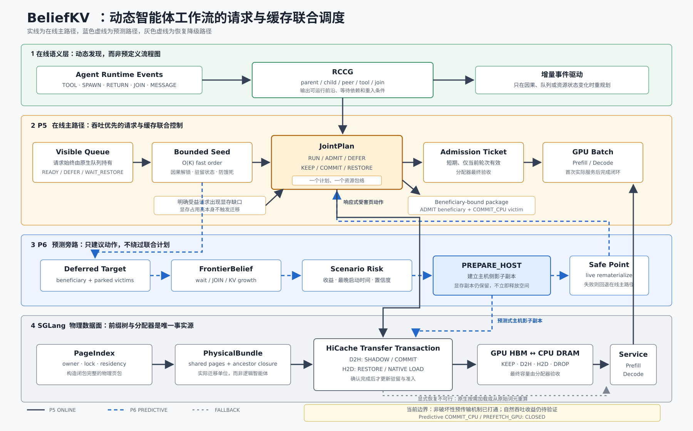

# BeliefKV 当前架构与实现状态

更新日期：2026-09-19
当前 P6 代码基线：`e364d05`

本文只记录当前事实和下一阻塞项，不再追加逐日开发日志。2026-09-12 以前的完整历史保存在
`docs/archive/snapshots/architecture_status_zh.md`，单次实验细节保存在
`docs/experiments/`。

## 1. 当前结论

BeliefKV 当前由两部分组成：

- P5：已接入在线路径的 observed-state Agent/KV JointPlan；
- P6：已将异步预测输出接入统一 JointPlan action group，代码路径同时覆盖
  predictive execution/admission 排序、`PREPARE_HOST`、真实 deficit 下消费 prepared
  victim 的 `COMMIT_CPU`，以及 latest-start `PREFETCH_GPU`。初步 GPU 高压对比未
  获得吞吐提升，当前瓶颈是预测信息没有稳定转化为 work-conserving execution set 和
  可隐藏的迁移动作。

预测器不直接提前驱逐 GPU KV。`PREPARE_HOST` ACK 会建立版本化的 beneficiary-victim
binding；真实 `ReclaimRequirement` 到来后，observed planner 优先消费仍有效且容量足够的
prepared victim，再执行 `COMMIT_CPU -> beneficiary priority -> first GPU service`。任何身份、
epoch、物理 closure 或容量失效都回退当前 P5。

## 2. 模块状态

| 模块 | 状态 | 当前边界 |
| --- | --- | --- |
| Runtime event + RCCG | 可用 | 动态 SPAWN/RETURN/JOIN/TOOL/MESSAGE |
| Visible waiting queue + AdmissionTicket | 可用 | SGLang allocator 最终验收 |
| Work-conserving JointPlan | 可用 | 吞吐优先，fairness 仅防饿死/tie-break |
| PageIndex + PhysicalBundle | 可用 | 多 owner、generation、lock、closure |
| Reactive `COMMIT_CPU/DROP` | 可用 | 只由明确 beneficiary deficit 触发 |
| Running retraction | 可用 | 最新修复正在高压回归 |
| Transactional restore | 可用 | H2D/native load/recompute，service 后终结 |
| FrontierBelief | schema-v5 formal train/calibration artifact | 直接拟合 operational-tau、pooled demand 与稀有分类；`test_id` 仍封存，`online_eligible=false` |
| Predictive execution/admission | 已接入 | 仅使用校准 token demand 做 SRPT/HBM 排序；RCCG/observed seed 保留因果优先级，native allocator 最终验收 |
| Predictive `PREPARE_HOST` | 已接入 | D2H 后保留 GPU KV，并建立 beneficiary-victim binding |
| Beneficiary-bound `COMMIT_CPU` | 已接入 | 只由真实 deficit 授权，优先消费 prepared victim |
| Predictive `PREFETCH_GPU` | 完整服务路径已接入，收益未验证 | 支持完整、ancestor-closed partial、latest-start retry、首个 service quantum funding 和 first-service attribution；development artifact 需显式 override |
| `RECLAIM_AND_PREFETCH` | development canary | `COMMIT_CPU(victim) ACK -> H2D(target) ACK -> service lease`；尚无自然在线闭环证据 |
| Oracle | 暂停 | 仅作契约测试和诊断 |
| Morphology 独立策略 | 不再使用 | transfer shape 仅作成本/OOD 输入 |

## 3. 当前在线算法

```text
Agent events
    -> RCCG
    -> bounded observed seed + FrontierBelief
    -> CausalActionPackage
       {execution order, ADMIT/DEFER, beneficiary, victim, deadline}
    -> JointPlan ActionGroup
       {SCHEDULE, PREPARE_HOST, COMMIT_CPU, PREFETCH_GPU, RESTORE, RETRACT}
    -> safe-point physical validation
    -> AdmissionTicket / HiCache command
    -> SGLang batch / DMA
    -> ACK + first GPU service
```

同步 safe-point 只执行有界状态捕获、seed 和动作局部校验；预测与 scenario evaluation 在
异步 worker 中运行。任何 stale、OOD、资源不可行或收益不足的预测结果都回退 P5。

wait-shadow 路径已将“预测输入观测时间”和“intent 实际发布时间”拆分。v48 中真实
publish-to-validation P95 为 0.395 ms，same-safe-point validation P95 为 0.761 ms；但
source-observation-to-validation P95 仍为 750.16 ms。后者主要来自 bounded physical preview
枚举所有子树的近似 O(N^2) 扫描，`38c389b` 已改为基于一次 `private_subtree()` 结果的线性
候选选择。该优化仍需短 GPU gate 验证，不能仅凭 CPU 回归宣称端到端时延合格。

在线预测权限已收敛为 action-minimal 接口：execution/admission 只消费 remaining decode、
next output 和实际 startup/growth demand；`PREPARE_HOST/PREFETCH_GPU` 只消费 live transfer
`tau` 下的 wait/reentry survival、prompt/KV growth 与 RCCG dependency。boundary rare-class 和
tool-terminal 分类继续记录和评估，但不再参与排序、support gate 或物理动作授权。需求 head
不可用时保持 observed seed 顺序，不使用请求 ID 构造新的预测顺序。

当前架构图：



## 4. 已验证证据

### 4.1 控制面

最近有效结果中：

- natural PREPARE run 的 safe-point capture P50/P95/P99：
  0.227/0.433/1.083 ms；
- deterministic PREPARE gate：
  0.293/0.526/0.829 ms；
- predictive compose/scenario 的最近 P95：
  27.41/19.32 ms，total 49.45 ms；
- worker 在对应 gate 中无 pending、drop 或 failure。

同步路径已经达到可接受范围；异步预测计算仍需限制触发频率和候选规模，但不会阻塞
SGLang scheduler。

### 4.2 PREPARE_HOST 机制

2026-09-12 的 deterministic gate 完成一笔真实 D2H：

- 766,083,072 bytes；
- 2 extents；
- intent、safe-point、queue、dispatch、DMA、ACK、terminal 全链路守恒；
- physical commit wall/thread CPU：4.284/2.217 ms；
- 无 orphan command、lease、reservation 或 transaction。

该结果只证明机制正确，不证明自然 workload 有吞吐收益。

### 4.3 自然机会

最近 64-root natural run：

- HBM peak 86.28%；
- HBM 大于 80% 持续 413 秒；
- 最大 migratable KV 68.79 GB；
- bounded-seed beneficiary 的 future-growth deficit 始终为 0；
- 367 次 `capacity_available`、242 次 `slot_only`；
- 0 natural predictive command。

这些数据只能说明旧探针针对 bounded-seed 首个 beneficiary 没有识别出 deficit。它们
不能区分“workload 没有优化机会”和“机会存在，但 beneficiary 搜索、动作组合或提交
时机没有利用该机会”。当前工程判断更倾向于后者，后续必须用完整 decision funnel
验证，不能再把 0 predictive command 直接解释为 0 opportunity。

### 4.4 数据面与 CUDA Graph

- H200 BF16 KV pool：850,000 tokens；
- Host pool：192 GB decimal（SGLang `hicache_size` 乘以 `1e9`；v10 由 64-root、
  max-running 96 高压实验使用）；
- CUDA Graph 已覆盖 batch 1/2/4/8/16/24/32/40/48/56/64/72/80/88/96；
- 4-extents 6.44 GB gate 中 D2H 249.8 ms、H2D 692.4 ms；
- 当前 backend 不声明 concurrent PCIe transfer capability。

### 4.5 2026-09-16 时间线与预测接口审计

已有 baseline/predictive trace 的独立时间线显示：

- mean running requests：25.74 / 14.73；
- GPU utilization mean：8.79% / 7.98%；
- DMA 与 GPU busy 重叠：18.79% / 13.06%；
- predictive 侧只有 6 个 intent、1 个 commit，未形成可测 saved stall。

因此当前 predictive arm 没有改善流水线，不能作为 P6 收益证据。详细结果见
`docs/experiments/beliefkv_p6_execution_timeline_and_action_interface_2026-09-16_zh.md`。

FrontierBelief v4 已改为 PREPARE/PREFETCH 动作专属校准。为快速排除旧 runtime 数据分布
问题，又使用最新 40-root observed baseline 训练了 development-only v5 adaptation。v5 在
独立 calibration 上的 PREPARE/PREFETCH Brier skill 为 +3.20%/+15.80%，PREFETCH recall@0.5
从 14.72% 提升到 20.34%；boundary 对 `spawn/final` 的 recall 仍为 0。v5 明确保持
`online_eligible=false`，同 workload 结果不能作为泛化证据。详细结果见
`docs/experiments/beliefkv_p6_baseline_adaptation_2026-09-16_zh.md`。

### 4.6 PREFETCH 召回与执行闭环

在不采集新 GPU trace 的前提下，当前 64-train、40-workflow baseline adaptation 和独立
16-workflow calibration 已重建为 development-only v6。PREFETCH 不再使用固定 0.5 阈值，
而是在 calibration 上以 F2 和 precision floor 选择动作阈值：

- 阈值：0.1850；
- recall：20.34% -> 64.67%；
- precision：68.93% -> 36.17%；
- Brier skill：+15.80%；
- calibration 正例率：17.29%。

该阈值只扩大语义候选召回，不能绕过物理 closure、HBM、transfer、latest-start 和净收益
门禁。候选器会检查前四个 target。固定 5% HBM 单动作上限已经删除；目标超过实时 free HBM
时，可以选择 ancestor-closed partial prefix，或由一个 commit-ready `DUAL_CLEAN` victim 为
target 提供容量。所有路径仍受实时容量、closure、latest-start 和净收益约束。

PREFETCH H2D ACK 后建立有界 service lease：目标 request 在首次真实 GPU service 前获得
admission 优先级，并暂时不能成为反向 eviction victim。若 reentry request 已可见，runtime
还会通过 allocator-backed funding 保留一个有界的 prefill/decode service quantum；native
admission 尝试前临时释放，失败后重获，首个 service 或 lease 终止时归还。该机制避免 H2D
成功后立刻被迁出或因后续 KV 增长长期得不到 service，但不会为完整 context 无限预留 HBM。
详细实现与证据见
`docs/experiments/beliefkv_p6_prefetch_recall_enablement_2026-09-16_zh.md`。

### 4.7 当前预测头质量

以下结果来自 schema-v5 artifact 在冻结的 16-workflow calibration split 上的重放；64 个
train workflow 用于拟合，LOPO 只在 7 个 train project 内选参，`test_id` 仍封存。
分类 accuracy 必须与多数类基线一起读，区间 head 使用 episode-weighted MAE 和 coverage：

| Head | Held-out calibration | 当前用途 |
| --- | --- | --- |
| Boundary type | NLL 0.1869；top-2 accuracy 99.67%；FINAL/SPAWN top-2 recall 97.72%/73.76% | 供 scenario composition；不以失衡的 top-1 argmax 直接授权动作 |
| Tool terminal | accuracy 81.75%（多数类 79.63%）；error recall 51.10%；NLL 0.4339 | 可区分部分失败风险；censored 仍不作为可预测终态 |
| Next output | MAE 175.84 tokens；workflow-macro episode coverage 88.40% | 有不确定性的短期 demand |
| Prompt growth | MAE 2,002.41 tokens；workflow-macro episode coverage 91.75% | 保守 HBM growth envelope，区间仍较宽 |
| Remaining decode | MAE 384.54 tokens；workflow-macro episode coverage 90.40% | 比 v6 降低约 11.9%，仍不等同 exact run-to-boundary |
| PREPARE operational tau | Brier 0.0501，skill +19.21%；高置信度 precision 99.90%、recall 76.51% | 直接预测 live D2H tau 下的等待裕量 |
| PREFETCH operational tau | Brier 0.0775，skill +45.67%；0.5 阈值 precision/recall 69.91%/62.80%；动作阈值 precision/recall 59.66%/90.56% | 直接预测 live H2D tau 下的 reentry 风险；仍须物理与价值门禁 |
| JOIN/WAIT_CHILD | 不直接学习 wall-clock；由 RCCG 对 child scenario 做 ALL/ANY 组合 | 依赖 child head，尚无独立 end-to-end accuracy |
| WAIT_MESSAGE | 当前 artifact 无独立模型 | unsupported/OOD，不驱动动作 |

schema-v5 不再把 action target 仅用于评估：20,864 条 train action outcomes 直接拟合
`P(release <= live tau | state, elapsed, role, tool, backend, command, context)`。旧层次经验模型
只作为 schema-v4 兼容 fallback。exact incremental boundary 仍为 0%，因此不支持 early
dispatch 或 exact run-to-action；这与 runtime boundary/top-2 scenario prediction是不同能力。

## 5. 2026-09-15 最新正确性修复

当前工作区已完成：

- 失败 JointPlan mirror 的恢复；
- workflow 不再被固定 activation cutoff 强制截断；
- running retraction 前强制核对 allocator、Radix 和 engine live ownership；
- 修复 live KV 被错误留在 allocator free pool 的风险；
- restore ticket 在物理路径变化后会回退到可推进状态，restore owner 未就绪时不再
  冻结整个 waiting queue；
- v7 runtime profile 和 versioned SGLang ownership patch。

这些变更尚不能自动转化为性能收益，必须先通过同一冻结 workload 的高压回归。

### 5.1 2026-09-16 prediction-to-action 时序修复

当前工作区已将 PREPARE 动作形成改为同一 safe point 内的事件对齐流程：

- `TOOL_START`、`WAIT_JOIN/WAIT_CHILD` 先发布轻量 semantic delta，不再携带旧 hint
  直接执行 PREPARE risk evaluation；
- semantic event 不再受 100 ms progress coalescing 限制，最迟在下一次 5 ms policy check
  进入 worker mirror；
- runtime 使用一次性 PREPARE latch，随后绑定本轮最新 bounded seed beneficiary，并强制
  重建最多两个 parked victim 的 action-local overlay；
- beneficiary/HBM bucket 不变也会提交一次事件对齐 risk evaluation，成功提交后才消费
  latch；没有 beneficiary 时保留 latch；
- pressure/full-plan 与 agent event 同批出现时，不再使用旧 hint 重复执行 PREPARE；
- 新增 `prepare_event_alignment_latched`、`prepare_event_aligned_hint_published`、
  `prepare_event_aligned_risk_published` 和 `prepare_event_to_hint_publish_ms` 观测。

CPU 回归为 `272 passed, 2 deselected, 8 subtests passed`；两项 deselected 仅依赖当前
shell 缺失的 `CUDA_HOME`。GPU 上的 event-to-hint、hint-to-risk 和
validation-to-latest-start 已完成短高压 gate 验证：40-root 运行中 HBM >= 80% 持续
322.56 秒，315 次 risk evaluation 产生 38 个正收益候选、37 个 timely fresh positive
package，最终 8 次选择 PREPARE，其中 7 次在 latest-start 前完成验证。worker 为
515 submitted / 515 completed / 0 failed / 0 pending。详细结果见
`docs/experiments/beliefkv_p6_event_aligned_high_pressure_shadow40_2026-09-16_zh.md`。

### 5.2 2026-09-17 schema-v5 在线 demand 接口修复

代码审计确认：schema-v5 的离线 train/calibration 与 predictive worker 候选局部推理已经
生效，但 bounded observed seed 过去只在旧 retraction predictor 开关启用时填充
`_last_frontier_predictions`。正式 P6 配置关闭该开关，因此 beneficiary hint 会退化为
`max_new_tokens=4096` 的静态 demand 上限，导致 beneficiary future-deficit、victim capture
和 latest-start 不能代表 schema-v5 输出。此前 GPU 结果可用于验证物理机制和 HBM 观测，
不能用于声称 schema-v5 demand 已经驱动在线动作。

`af1a0f9` 将 bounded seed 的预测接口改为 action-local、缓存化推理：

- 只检查 seed 排名前四且仍 deferred 的 invocation；
- 以 invocation state、boundary history、context/generated tokens 和 tool backend/command
  组成紧凑特征签名；
- 特征不变时复用预测，只有候选或特征变化时调用 schema-v5；
- 将 remaining decode P90、next output P50、support/OOD 回填到 runnable 与 beneficiary hint；
- predictive worker 继续对完整候选 closure 独立推理，safe point 不恢复全局 invocation 推理。

新增 `bounded_seed_prediction_ms/inferred/cache_hit/failed` 观测。定向 adapter 测试为
`5 passed`，P6 predictive 回归为 `68 passed`；完整 adapter 的 2 项失败仅因为当前 shell
没有 `CUDA_HOME`，其余 `174 passed, 8 subtests passed`。下一次长高压 gate 必须确认
在线 hint 的 `prediction_support_level` 不再为 `unavailable`，并覆盖完整
`PREFETCH_GPU -> H2D ACK -> service lease -> first GPU service` 路径。

### 5.3 2026-09-17 PREFETCH 完整服务路径修复

`c7fba92` 修复了 H2D 完成前后仍会破坏预测收益的三个状态机缺口：

- `prefetch_too_early` 不再删除 intent，而是保留到 action-dependent latest-start 后重试；
- H2D ACK 后为目标 reentry request 建立有界 allocator-backed service funding，复用现有
  admission-rescue 的“尝试前释放、失败后重获、首个 service 后终止”协议；
- 首个真实 GPU service 会同时释放 lease/funding，并将 predictive attribution 终结为
  `useful`，不再留到 shutdown 时被错误 censor；
- risk candidate generation 不再在第一个 target 后无条件退出，最多四个 semantic target
  可以进入完整价值评估；partial prefetch 不再要求 live bundle 与旧 `copy_bytes` 完全相等，
  而是使用已有的 reclaim/cross-context/copy envelope 做安全校验。

CPU 回归为 `176 passed, 2 deselected, 8 subtests passed`；两项 deselected 仍仅依赖当前
shell 缺失的 `CUDA_HOME`。predictive risk/JointPlan/worker/attribution 定向回归另有
`70 passed`。GPU 端尚未验证，不能据此声称吞吐收益或在线 PREFETCH precision 已通过。
`41a1239` 进一步让 performance mode 保留 lease registered/released 和
`predictive_action_outcome` 三类低频事件，确保长 gate 能观察完整闭环而不恢复逐 step 审计。

### 5.4 2026-09-18 多目标 reentry 与 JOIN prefetch 修复

长高压 v18/v19 gate 证明冻结 64-root、hard-64 workload 能自然达到接近 100% 的物理
HBM 压力，并产生原生 D2H、真实 CPU-side KV 和可物化的 predictive reentry 候选。
`4a82c4e` 将单一 reentry watcher 扩展为最多三个分层目标，覆盖 `WAIT_TOOL` 与
`WAIT_JOIN/WAIT_CHILD`，并按未完成 dependency 和 child progress 计算 JOIN ALL/ANY 的
release probability；v19 共发布 643 次 reentry risk、1,929 个目标，说明 watcher 不再只盯住
同一个 tool wait。

v19 在受控停止前形成 127 个 fresh-positive package，最大期望收益约 3,188.90 ms，但旧的
固定 0.5 dependency timing gate 又将它们拒绝。该 gate 与已经执行的 scenario expected
benefit、CVaR 和 future-HBM 检查重复，而且 JOIN/dependency release 没有独立校准阈值。
`5030207` 因此让未校准的 dependency-composed prefetch 信任完整 scenario risk 结果；
`WAIT_TOOL` 仍使用 artifact 中的动作校准阈值。此修改只移除错误的重复 veto，没有降低
expected-benefit、容量、物理证书或 latest-start 门禁。

v19 的 BeliefKV shutdown 已满足 ACK、transaction、lease 和 obligation 守恒，但启动器 shell
退出后 SGLang frontend 曾作为孤儿进程继续占用端口和 GPU。`5152382` 为 launcher 记录 PGID，
stop 脚本在验证进程组身份后清理残留 SGLang 组。当前 v20r 用于同时验证该关闭路径和完整
`PREFETCH_GPU -> H2D ACK -> funding/lease -> admission -> first service -> useful` 归因链。

### 5.5 2026-09-18 child tool-return 与事件摄取活性修复

`d13663f` 将 child 自身的 `TOOL_START -> TOOL_END` 纳入 rolling reentry watch。
watch 以 invocation/context epoch 和 tool-call identity 为版本边界，在 child 已存在 CPU-side
KV 时参与 latest-start `PREFETCH_GPU` 评估；`TOOL_END/REACTIVATE/RETURN/CANCEL`
或身份失效会清理 watch。该路径不要求等待 parent JOIN，因而可以恢复仍需继续多轮执行的 child。

同一提交修复了高事件量下的 scheduler 空转：ObservedDataConsumerIndex 原先在每批 runtime
event 上递归深拷贝完整历史，约 13K 事件时使 scheduler 单核长时间卡住、GPU 停止获得 batch。
ConsumerEdge/ConsumerIndexDelta 为不可变对象，现改为浅层容器快照并保留原子回滚。13,500
条历史微基准 P95 为 1.17 ms；相关 CPU 回归为 234 passed、8 subtests passed（另有两项仅因
本机 shell 缺失 CUDA_HOME 而排除）。

`2c30c9f` 新增 h200_bf16_v10，将 Host KV 从 96 GB 扩展到 192 GB decimal，保持 HBM 850K、
max-running 96 和 graph96 不变。v26 启动已确认 graph 捕获到 96、Host slab 为 192 GB，
workload 启动后 running 92-95、waiting 29-32，GPU 重新持续获得 prefill/decode 工作。
该启动证据只证明活性修复和容量契约生效；child rolling prefetch 的完整归因仍需等待后续
CPU-side child KV 与 timely latest-start 自然出现。

### 5.6 2026-09-19 wait-window gate 与状态机修复

v45 高压运行验证了 `778caa6` 的 stale-trigger starvation 修复：21 个持久化 risk
snapshot 的 trigger 数量始终为 3，最新集合只包含当前 reentry 目标，不再累积历史 trigger。
实验随后受控停止；shutdown summary 满足 `no_pending_transactions=true` 和
`shutdown_cleanup_did_not_mask_unresolved_transactions=true`。

同一运行也确认一直缺少 predictive prefetch 的关键原因不是工具调用都太短。child tool
调用中存在大量 0.25--2 秒窗口，且一笔约 2.52 秒的 `execute` 已成功容纳 PREPARE D2H。
旧 gate 的问题是首笔 PREPARE 后用累计 `prepare_host_queued` 永久封锁后续动作、固定
1500 ms control lead 排除了大量可用窗口、native transfer busy 只产生瞬时拒绝，以及低于
80% HBM 时不进入收益判断。

`d43d8c1` 将 PREPARE limit 改为并发物理动作边界；完成动作不再消费后续窗口。native
transfer 或 residency transaction 忙时进入 100 ms 有界重试；低压只记录诊断，仍由 timing
probability、live D2H cost 和净收益决定是否发布。control lead 已成为显式配置，当前临时值为
250 ms，仅用于关闭 prefetch 机制闭环；其最终取值必须在完整 predictive H2D 验证后，基于
transfer 分布、预测刷新频率、误触发率和 saved stall 单独标定。该提交尚未经过新的 GPU
prefetch 闭环验证，不能据此声明吞吐收益。


### 5.7 2026-09-19 wait-shadow same-safe-point 提交修复

v46 最终有 444 个 `PREPARE_HOST` intent 因 invocation/tool 状态变化被拒绝。逐事件对齐后，
intent publish 到 safe-point validation 的 P50/P95 为 991.98/2,283.03 ms；TOOL_START 到
validation 的 P50/P95 为 1,478.83/3,094.94 ms。259 个 intent 在对应 TOOL_END 之后才发布。
199 个对应工具总时长超过 500 ms，但其中只有 16 个在 intent 发布时仍剩超过 500 ms。
因此该问题是控制链迟到，不是“没有长工具窗口”。

`994de39` 将 child TOOL_START 设为立即预测触发，并让新 wait-shadow intent 在发布所在的
physical safe point 直接复用当前 observed decision、缓存 physical preview 和 action-local
certificate 完成验证；不再等待下一轮 JointPlan reuse/refresh。TOOL_END、REACTIVATE、
RETURN 或 CANCEL 到达时会撤销尚未提交的同 invocation intent。live bundle、transfer
envelope、Host capacity、事务互斥和 commit budget 均继续重验，没有放宽安全门禁。

新增 `wait_shadow_publish_to_validation_ms` 及 same-safe-point wall/CPU 指标。CPU 门禁为
270 passed、8 subtests passed；另 2 项仅因当前 shell 缺少 `CUDA_HOME/deep_gemm` 无法
import SGLang。GPU P95 尚未复验，下一轮目标是 publish-to-validation P95 <50 ms，并至少
观察一笔在真实工具窗口结束前进入 D2H queue 的 PREPARE。详细审计见
`docs/experiments/beliefkv_p6_wait_shadow_validation_latency_v46_2026-09-19_zh.md`。

### 5.8 2026-09-19 PREPARE 收益绑定与 PREFETCH 证书刷新

v50 自然运行中的中期审计证明 wait-shadow 控制链已经足够快，但动作效用仍不足：
510 个 `PREPARE_HOST` command 中 453 个 D2H ACK，336 个后来因工具返回浪费，57 个失败；
其中 56 个失败是 D2H 完成后 Radix node 变为 engine-locked。更重要的是，这些 wait-shadow
PREPARE 没有携带 beneficiary identity，因此 ACK 后没有形成任何
`prepared_causal_binding`，自然无法在真实 deficit 出现时被 observed planner 消费。

PREFETCH 侧已有 19 个 semantic intent、4 个 root context 和 7 次 watch activation；
activation lag P50 约 108 ms、max 489 ms。未闭环的原因不是发布耗时，而是到达 latest-start
时 intent 证书年龄已达 3,376--6,180 秒，context epoch / invocation revision 已变化。telemetry
中 49 笔 `prefetch_context` H2D 均为 `restore-*` 且 `predictive_intent_id=null`，不能计为
predictive prefetch。

`87411cc` 做了三类窄修复：

1. 低于 observed admission watermark 的 wait-shadow 直接抑制，不再为了低价值 canary 复制；
2. wait-shadow PREPARE 必须绑定一个当前可见且存在 immediate/future HBM deficit 的
   beneficiary，并把 deficit、startup/growth 和 causal generation 写入 intent；ACK 后可形成
   prepared binding，供真实 `ReclaimRequirement` 消费；
3. 到达 latest-start 的 prefetch watch 只能激活新鲜证书；旧证书强制 worker refresh，
   每 50 ms 有界重试，而不是激活小时级旧读集。已完成 D2H 的瞬时 engine lock 改为等待锁释放
   后再提交，不再丢弃已完成的 DMA copy。

定向回归 7 项通过；SGLang adapter 全套为 200 passed、2 deselected、8 subtests passed，
两项仅因当前 shell 缺失 CUDA_HOME/deep_gemm 导入被排除。该修复尚未进入任何 GPU 运行；
v50 仍在旧进程上自然运行，不能用来评价新修复。

### 5.9 2026-09-19 predictive H2D 物理闭环

v51 暴露 `87411cc` 的一个崩溃缺陷：beneficiary 排序访问了不存在的
`BeneficiaryOpportunityProbe.service_lag_ms`。`5b0045e` 改用 hint 自带的
`service_lag_ms`，该类崩溃关闭。

`1d559d7` 将 PREPARE 拆为两种模式：高压且有明确 deficit 时仍 beneficiary-bound；
低压或高压暂无 beneficiary deficit 时，只要 Host 低于低水位且 PCIe 空闲，允许 unbound
opportunistic partial PREPARE。该动作仍受 64 MiB chunk、长等待概率、native transfer
互斥、干扰成本和 Host 水位约束。v54/v55 证明该路径能产生连续 predictive D2H。

长期 parent-JOIN watcher 的预测 reentry 可达数十分钟，不能用于快速验证物理 H2D。v54 的
native demand-load 统计显示，可见 request 到 native H2D 平均有约 49 秒窗口；因此
`312ab69` 增加 observed-service prefetch 快路径：当可见 waiting request 的 context 已有
CPU-only KV 且缺少 GPU KV 时，立即生成 `PREFETCH_GPU` intent，并在同一 safe point
物化。

v57 首次完成自然 predictive H2D 归因链：

```text
visible request
  -> observed-service PREFETCH_GPU intent
  -> same-safe-point commit
  -> PREFETCH_CONTEXT command queue
  -> H2D dispatch/ACK
  -> service lease
  -> request_started
  -> first GPU service
  -> useful attribution
  -> lease release
```

该笔 H2D 传输 325,189,632 bytes、11 extents、耗时 89.72 ms，telemetry 保留非空
`predictive_intent_id`。H2D ACK 后 667 ms 注册 service lease，request 获得首个 GPU
service 后标记 `useful` 并释放 lease。检查时无 scheduler 异常、无 orphan transaction、
无 active lease/obligation。

v57 同时暴露两个后续问题：17 笔 atomic H2D 因旧的 authoritative-free-tokens 检查被拒绝；
74 个 service intent 曾因 immediate window 重复扣除 25 ms guard 被误判为 too early。后者在
`312ab69` 已修复；前者在 `a772a61` 中让携带 `allow_native_eviction` 的 service H2D 与
native demand-load 一样使用安全 native eviction，并通过 201 项 adapter 回归。v57 运行时
不包含 `a772a61`，因此它的 1/18 H2D 成功率是下界，不是最终策略成功率。

### 5.10 2026-09-19 Host 语义化清理与容量边界

64-root 长上下文 workload 的 unique live KV 已接近或超过 HBM+Host 总容量。当前 Qwen3 Coder
BF16 KV 为 98,304 bytes/token：

| Tier | Tokens | 60K-token agents |
| --- | ---: | ---: |
| HBM 850K | 850,000 | 14.17 |
| Host 192 GB decimal | 1,953,125 | 32.55 |
| Total | 2,803,125 | 46.72 |

因此 64 个 root 加 children 会自然溢出，Host 不再是无限冷缓存；native writeback 会与
predictive shadow、future reentry 和 dead KV 竞争同一 Host 容量。

旧 Host high-watermark cleanup 有两个缺陷：所有 `DUAL_CLEAN` shadow 一律按 last-access 排序，
没有区分 native writeback 与 explicit/predictive copy；`CPU_ONLY` 只有 raw-prompt replay
guarantee 时才可清理，导致部分 dead/terminal context 在高压下无法释放。现已修复为：

1. `PhysicalPageRecord.host_copy_source` 区分 `native_writeback`、`explicit` 和 `predictive`；
2. Host cleanup 优先释放 dead `CPU_ONLY`；
3. 其次释放 dead `DUAL_CLEAN`，再优先 native-writeback shadow，最后考虑 explicit shadow；
4. active restore obligation、prefetch service lease、语义 pin 和非 parked owner 继续受保护；
5. dead CPU-only 不再要求 raw-prompt replay guarantee；live CPU-only 仍保留该要求，避免无法
   重算的 active context 被破坏。

全局 KV value model 暂不进入当前决策层。它可能提高长期命中率，但会把 execution、victim、
Host cleanup 和 reentry 预测耦合到一个大优化问题，增加控制面开销和决策不可解释性。后续只
作为独立分支评估，并用 shadow A/B 证明收益超过调度开销与决策耦合风险。

SSD 第三层同样暂不实现。它可扩展 cold/parked KV 容量，但会引入异步 I/O、 durable metadata、
tier staging、恢复路径和新的驱逐问题。在 Host 语义化清理和容量/命中率证据稳定前，加入 SSD
会使系统复杂度过高。后续只在 Host miss 或 forced eviction 证明存在大量可复用 cold KV 时评估。

### 5.11 2026-09-20 v58 predictive H2D gate

v58 自然完成 64/64 workflow。`a772a61` 的 service H2D native-eviction 修复将物理成功率
从 v57 的 1/18 提升到 24/25：22.15 GB predictive H2D 完成，20.97 GB 在首个 GPU service 后
进入 useful attribution。H2D duration P50/P95 为 510/1,245 ms。

运行 HBM pressure mean/max 为 97.4%/100%，Host used mean/max 为 169.5/192.0 GB。v58 未包含
`7ae2be6` Host 语义化清理，因此它证明了 predictive H2D 机制和高压容量边界，但没有解决 Host
侧竞争。唯一 API timeout workflow 的 restore obligation 因 request abort 取消；shutdown drain
将残留 command 显式置为 cancelled，最终事务、lease、obligation 全部清空。运行时仍有 1 笔
H2D completion ownership race 需要修复。

## 6. 当前阻塞项

1. prediction-to-action utilization gap 尚未闭合。初步 H200 高压运行中 predictive arm
   的 running set、GPU utilization 和 DMA/GPU overlap 均低于 baseline。
2. 当前 bounded composer 只评估前 2--4 个 request，并将最终物理候选限制为
   `1 beneficiary x 2 victims`。这是在线成本边界，不是全局最优保证。
3. schema-v5 已修复 action timing 低召回和 tool-error 多数类退化；boundary 仍应以 top-2
   scenarios 使用，不能把 top-1 accuracy 当作 exact action-unlock 预测。
4. `PREFETCH_GPU -> H2D ACK -> service lease -> first GPU service -> useful` 已在 v57 形成
   完整实测闭环；在线 precision、saved-stall 和吞吐收益仍未测量。
5. prepared binding 目前每个 beneficiary 只保留一个 victim；失效时回退 P5，不执行
   预测性 COMMIT。
6. v7 GPU service artifact 适合排序和 shadow；正式吞吐结论必须来自与冻结 observed
   baseline 相同 workload/profile 的 GPU A/B。
7. event-aligned 高压 shadow 已证明 `validation_ts < latest_start_ts`：37 个及时正收益
   package，最小 margin 76.09 ms。但 event-to-hint P95/P99 仍为 889.74/3236.16 ms，
   其中包含等待 beneficiary 出现的时间；提交端必须继续执行 latest-start 复验。
8. 高压 safe-point capture P95/P99 为 0.692/1.393 ms，略高于严格的 0.5/1 ms 目标；
   predictive planning P95/P99 已降至 43.81/59.50 ms。同步尾延迟仍需观测，但不再阻塞
   单笔 canary。
9. 2026-09-16 funded-prefetch gate 暴露 12 个 PREPARE 假阳性：典型 beneficiary 约
   21 ms 后阻塞，而 D2H P95 约 838 ms；单 victim 约 67 MB 也不足以覆盖约 416 MB deficit。
   `0ab8c09` 已在发布 intent 前拒绝过晚和回收不足的 package。
10. 修复后 bounded 在线复验运行约 20 分钟，1,300 个 hint 中 880 个容量充足、420 个仅受
    running slot 限制，原生 KV usage 约 31%，因此 0 victim、0 risk evaluation、0 prefetch。
    该轮证明假阳性消失，不证明预测调度收益。
11. v46 的 wait-shadow publish-to-validation P95 为 2,283.03 ms；v49 已验证 same-safe-point
    修复将 true publish-to-validation P95 降至 0.304 ms、source-to-validation P95 降至
    44.83 ms。该阻塞项关闭，剩余问题是动作效用而不是控制链延迟。
12. v50 已证明 publish 链路延迟达标，但暴露 prepared binding 缺失、瞬时 engine-lock 失败
    和 stale prefetch certificate。`87411cc` 已修复，仍需在 v50 自然结束后运行新代码 gate。
13. v57 的 17 笔 predictive H2D 被 atomic allocator 检查拒绝；`a772a61` 已允许 service
    H2D 使用 native eviction，但该修复尚未进入 GPU 运行。
14. 64-root 长上下文 workload 超过 HBM+Host 的 2.95M-token 总容量；native writeback、
    predictive shadow 和 future reentry 在 Host 侧竞争。语义化 Host cleanup 已实现，但尚未
    进入正在运行的 v58 进程。
15. 全局 KV value model 与 SSD tiering 均为可选未来分支，不进入当前关键路径；必须先用
    shadow 证据量化收益、开销和决策耦合风险。
16. v58 暴露 request-abort 后 inflight restore command 需要等待 shutdown drain 才显式
    cancelled，以及 1 笔 H2D ended-without-authoritative-GPU-copy race。

## 7. 下一步

当前关键路径：

1. 等待 v58 自然完成，统计 predictive D2H/H2D precision、saved stall、反向迁移和
   shutdown correctness；其中 atomic H2D native-eviction 已将中期成功率提升到 24/25。
2. 修复 request-abort command 即时清理和 H2D completion ownership race。
3. 将 Host 语义化清理合入下一轮 GPU gate，统计 dead/native-writeback/explicit
   cleanup bytes、forced recompute、Host miss 和 predictive H2D success rate。
4. 在 predictive H2D 成功率稳定后，测量相对于 reactive native demand-load 的 first-service
   latency 差值和端到端吞吐收益。
5. 若 Host forced eviction 仍然挤掉高价值 reentry KV，再离线评估全局 KV value model 和
   SSD cold tier；二者不得与当前调度修复同时上线。
6. 同时继续记录 event-to-hint 长尾和 safe-point P95/P99，不为降低开销重新关闭必要的
   `TOOL/JOIN` 风险触发。
7. execution 排序使用 RCCG 已知 unlock、schema-v5 token/HBM demand 和 top-2 boundary
   scenarios；任何单一分类 argmax 都不能覆盖 RCCG 确定性事实。
8. Gate 中任何 stale/OOD/物理化失败均回退 P5；不通过降低收益阈值制造动作。
9. PREPARE/PREFETCH 各自完成真实 beneficiary 消费后，再按 execution reorder、提前
   D2H、deficit-time COMMIT 和 latest-start H2D 分解收益，最后启动冻结 baseline/P6 A/B。
10. 当前 PREFETCH、shutdown 和归因 gate 通过后，再评估“固定物理上限 48、动态软目标
   `{32,48}`”：低 HBM 压力且存在 GPU-ready backlog 时扩展到 48；预测到 HBM 压力时
   停止新 admission 并自然排空到 32，不因阈值直接撤回 running request；parked KV 仍只
   通过 beneficiary-bound causal package 回收。该优化不得修改当前冻结实验。

该项属于后续吞吐优化，而不是当前 prediction-to-action gap 的替代解释。冻结 baseline 中，
`running >= 32 && waiting > 0` 约占 active time 的 4.89%（11.40 分钟），其中约 5.75 分钟
处于低于 70% HBM pressure 的状态；因此可能存在增益，但预期应通过统一 hard-48/graph-48
契约下的 fixed-32、fixed-48、dynamic-32/48 和 dynamic-32/48+P6 配对实验裁决。

执行细节见 `docs/implementation_plan.md`。

## 8. 权威资料

- 当前设计：`docs/beliefkv_design.md`
- 当前计划：`docs/implementation_plan.md`
- 文档导航：`docs/README_zh.md`
- 当前图解：`docs/beliefkv_jointplan_visual_zh.md`
- 历史状态：`docs/archive/snapshots/architecture_status_zh.md`
- 实验报告：`docs/experiments/`
