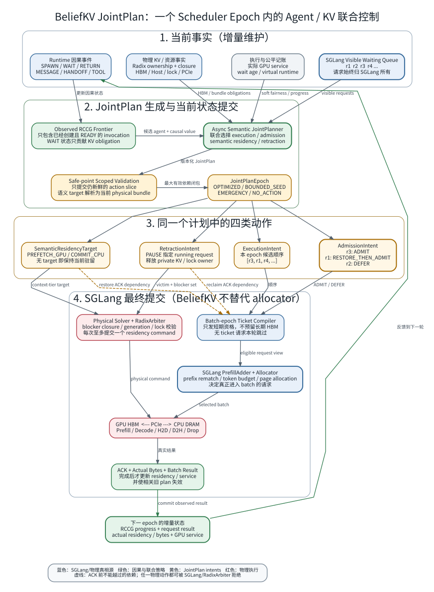
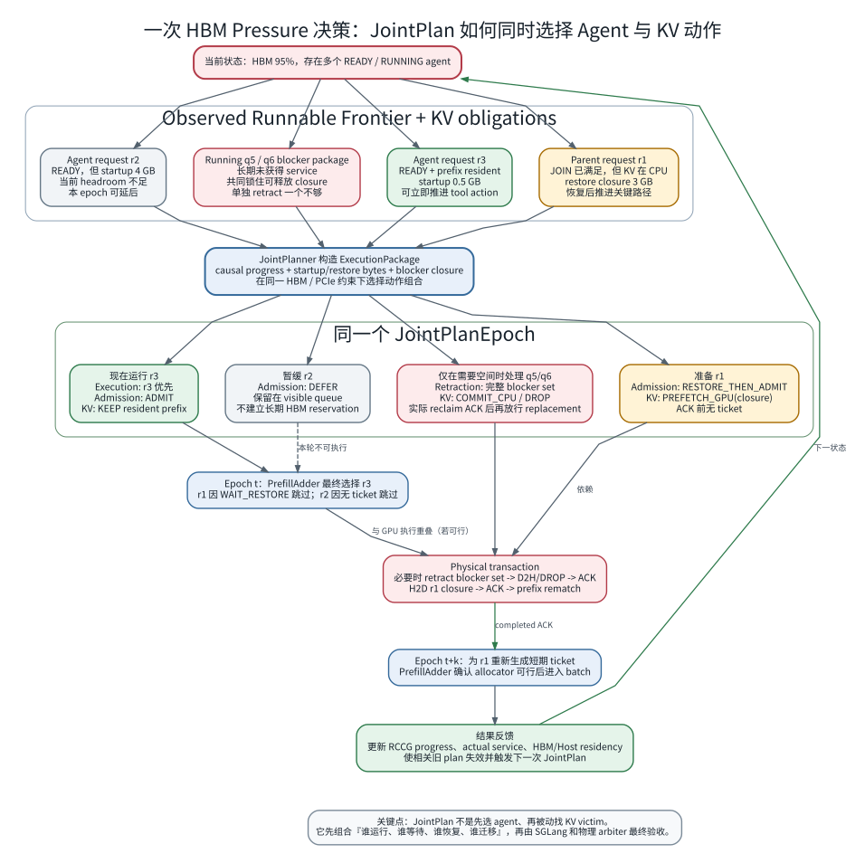

# BeliefKV JointPlan 图解

更新日期：2026-07-29

本文用两个视角解释 BeliefKV 如何在单 GPU 动态 multi-agent/subagent workflow 中同时管理
Agent request 和 KV cache。图对应当前 P5D 设计；相关代码已经完成 CPU/接口路径，但尚未通过
blocking、cyclic-peer 和 mixed workload 的完整 GPU gate，因此本文说明的是控制协议，不代表
已经证明性能收益。

## 1. 一个 Scheduler Epoch 的完整闭环



可单独打开高分辨率 [SVG](figures/beliefkv_jointplan_epoch.svg) 或
[PNG](figures/beliefkv_jointplan_epoch.png)。

JointPlan 使用四类输入：

1. RCCG 中已经发生的 spawn、wait、return、message、handoff 和 tool 事件；
2. SGLang visible waiting/running requests；
3. Radix ownership、physical closure、HBM/Host residency、engine lock 和 PCIe 状态；
4. 实际 GPU service、等待时间和软 workflow fairness。

异步 `AsyncSemanticJointPlanner` 只生成语义动作，不在后台绑定容易过期的 page handle：

```text
ExecutionIntent   谁在当前 epoch 优先参与 batch
AdmissionIntent   ADMIT / RESTORE_THEN_ADMIT / DEFER
SemanticResidencyTarget  PREFETCH_GPU / COMMIT_CPU（无 target 即保持当前驻留）
RetractionIntent  哪些 running request 可以 PAUSE
```

这些动作不是四个独立模块各自重新决策。它们属于同一个 `JointPlan`，并由
`TransferDependency` 表达先后关系。例如：

```text
PREFETCH_GPU(bundle B)
  -> completed ACK
  -> prefix rematch
  -> 为依赖 B 的 request 生成新 ticket
  -> SGLang PrefillAdder 最终 admission
```

在 scheduler safe point，BeliefKV 只提交仍然新鲜的 action slice，并将 semantic residency target
解析成当前 physical bundle。没有可用 optimized plan 时，系统仍使用相同 `JointPlanEpoch` 协议生成
`BOUNDED_SEED` 或 `EMERGENCY` epoch，不重新开放独立 reactive planner 选择另一套 victim。

## 2. HBM Pressure 下的一次联合决策



可单独打开高分辨率 [SVG](figures/beliefkv_jointplan_decision.svg) 或
[PNG](figures/beliefkv_jointplan_decision.png)。

图中三个 waiting request 的处理不同：

| Request | 当前状态 | JointPlan 动作 | 原因 |
| --- | --- | --- | --- |
| `r3` | READY，prefix 已在 GPU | `ADMIT + KEEP` | 可立即进入 batch 并推进 tool action |
| `r1` | JOIN 已满足，但 KV 在 CPU | `RESTORE_THEN_ADMIT + PREFETCH_GPU` | H2D ACK 前不能进入 batch |
| `r2` | READY，但 startup 过大 | `DEFER` | 当前 HBM headroom 不足，继续留在 visible queue |

如果恢复 `r1` 仍缺空间，JointPlan 可以同时指定 running retraction。此时不是简单选择“最大的
request”，而是选择能够真正解除 physical closure 的完整 blocker set：

```text
RetractionIntent(q5, q6)
  -> SGLang selective retraction
  -> current-state physical closure solver
  -> COMMIT_CPU / DROP
  -> allocator reclaim + physical ACK
  -> replacement request 获得一次新的 epoch ticket
```

单独 retract `q5` 若不能让共享 extent 的 lock ref 归零，就不能把对应字节计入可释放空间。

## 3. JointPlan 管理 Agent 与 KV 的状态表

| Agent/request 状态 | Agent 调度动作 | KV 动作 | 执行条件 |
| --- | --- | --- | --- |
| `READY` 且 KV resident | 当前 epoch ticket | `KEEP` | PrefillAdder/allocator 最终可行 |
| `READY` 且 KV CPU-only | `WAIT_RESTORE` | `PREFETCH_GPU` | completed H2D ACK 后重新发 ticket |
| `WAIT_TOOL/WAIT_CHILD/WAIT_JOIN` | 不进入当前 batch | 无 target / `COMMIT_CPU` | 数据面可先执行 `PREPARE_HOST`，再提交 CPU-only 状态 |
| `RUNNING` 且持续未获 service | 可选 `PAUSE` | retraction 后 `COMMIT_CPU/DROP` | 必须选择完整 blocker set，至少保留一个 running request |
| `TERMINAL` | 不再调度 | `DROP_DEAD/cleanup` | shared owner、lock 和 in-flight 均已解除 |
| `transition-open/unknown` | fail closed | `KEEP` | 等待原子事件或确定状态 |

## 4. BeliefKV 与 SGLang 的边界

BeliefKV 决定的是**意图和依赖**，不是直接修改 KV tensor：

```text
BeliefKV owns:
  RCCG / candidate order / admission eligibility / residency intent / dependency

SGLang owns:
  waiting queue / PrefillAdder / allocator / Radix topology / KV tensor / DMA
```

因此：

- request 不会被 BeliefKV 长期隐藏在第二个队列中；
- ticket 只在一个 batch-construction epoch 内有效，不产生长期 HBM reservation；
- 无 ticket 或 `WAIT_RESTORE` request 本轮执行 `continue`，不会阻塞后续候选；
- SGLang 或 `RadixArbiter` 可以因 token、capacity、generation、lock 或 closure 拒绝计划；
- residency 只在真实 ACK 后提交，随后相关 plan 失效并重新规划。

一句话概括：

> JointPlan 把“现在让哪个 Agent 运行”与“为了这个执行顺序，哪些 KV 应保留、恢复、迁移或释放”
> 组成同一个带依赖的计划；SGLang 再负责把仍然物理可行的部分原子地落到 batch 和 KV 数据面。
