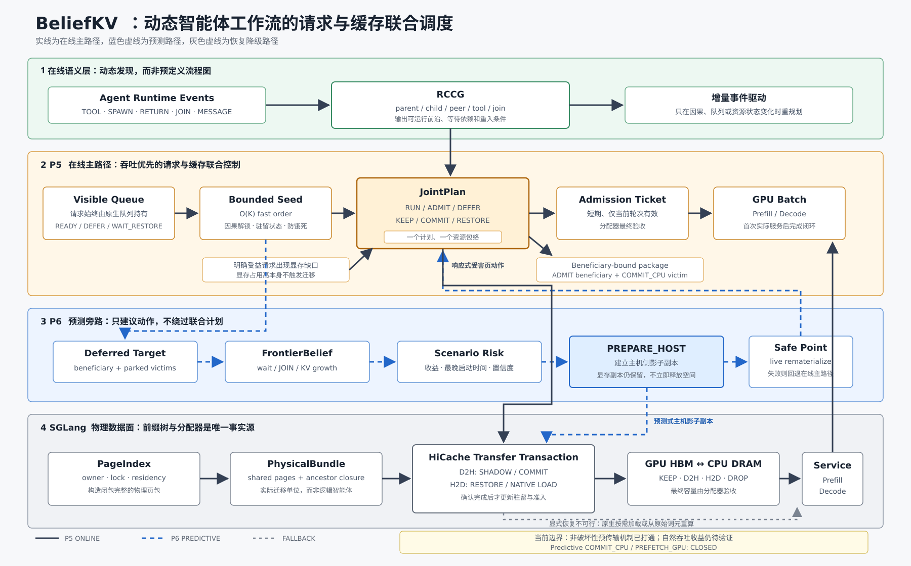

# BeliefKV 当前系统设计

更新日期：2026-10-05

状态：本文是当前算法与系统边界的权威说明。历史版本保存在
`docs/archive/snapshots/beliefkv_design_2026-07-14_zh.md`。

## 1. 研究场景与目标

BeliefKV 面向单 GPU、HBM 受限的动态 Agent 工作流：

- 多个 root workflow 并发运行；
- workflow 在运行时产生工具调用、FRESH subagent、RETURN、JOIN 和 peer message；
- 系统不要求应用预先提供完整 DAG；
- GPU KV、CPU KV 和 raw-token recompute 可以共同参与容量管理；
- SGLang RadixCache/HiCache 仍是物理 KV 与 allocator 的唯一事实源。

主要优化目标是**相同到达流下的成功 workflow 吞吐及 JCT 分布**；
任务正确性、无界饥饿和物理容量安全是不允许交换掉的约束。
GPU service utilization、action throughput、action unlock、reentry/admission
stall、D2H/H2D、recompute 与控制面开销是用于解释因果和判断退化的指标，
不能仅凭 GPU 利用率或预取次数宣称性能收益。

Workflow fairness 只作为有界防饿死和最终 tie-break，不以平均分配 GPU 时间为目标。

### 1.1 当前阶段目标：低重算负载中的可行动迁移

当前开发验证为84-root单波、running=48、NUMA node 1的200 GB
Host池，FULL/Mamba分别验收。当前只有一对reactive/predictive；
多轮取平均留到正式实验，固定需求GPU回放不是主线前置条件。
实际实现和未完成项以 `docs/architecture_status_zh.md` 为准，
下文旧P5/P6路径的机制描述不代表新版已完成全部JointPlan迁移。

**本阶段唯一主目标：**在 Qwen3.5/SGLang v0.5.20 上，找到
FULL/Mamba HBM 有可用于目标 H2D 的真实空闲容量、同 NUMA Host
池稳定、PCIe 有传输窗口，且有用 KV 丢弃后重算很少的动态负载。
在真实后续消费存在时，以选择性、可部分备份的 `PREPARE_HOST`
和提前恢复 Host-backed KV 的 predictive H2D，减少同步迁移等待，
并通过同任务、同到达流、同物理配置的 reactive A/B 检验正确完成
workflow 的吞吐和 JCT 净收益。物理余量按每次动作的 FULL/Mamba
需求分别核实，不由总体 HBM 使用率推断。不为提高迁移次数制造
Host 驱逐或 KV 重算；冷 KV 的有界替换、联合 handoff 和高压
减少重算均单列为后续扩展，不作为主结果的前提。
同时需要真实的工具等待、child JOIN 或候选执行请求，确保提前迁移
有未来消费对象：PREPARE 必须有未来卸载机会，H2D 必须有尚未在
Device 驻留的有效 Host-backed KV。HBM 空闲本身不构成收益。
这是待测工作区间，不以 root 数、GPU 利用率或单个使用率定义。由训练项目上的并发/到达
压力扫描冻结主配置，不预设 64+64 或必须使 Host/HBM 满载。
高压作为物理机会枯竭、计算饱和及 Host thrash 时的安全回退/研究边界，
不以减少高压重算或在饱和计算中多发迁移作为近期目标。

主场景的准入必须同时核对：FULL/Mamba Device 与 Host 的各自余量、
有效 Host 副本或未来可消费的部分备份、传输及首次服务之间的时间窗口、
Host 驱逐到后续 miss/重算的归因，以及服务端和 workflow 的正确性。
在训练项目上冻结机会数量、低重算、传输余量和驻留成本判据及动作预算；
不以空闲 HBM 比例、低 Host 驱逐次数或某个 root 数单独代替可行动机会。
若找不到这样的工作区间，
应如实报告机会和收益上界，而不是提高压力以制造迁移次数。
当前阶段不以高压环境下的 KV 驱逐优化、重算率降低或联合 handoff
为验收条件；高压迁移开销可能已被计算或排队隐藏，不能将更多传输
等同于更高端到端收益。

在这个工作区间，优先验证两条传输路径的**实际效用**：

1. `PREPARE_HOST` 选择未来更可能卸载且值得复用的祖先闭包，可先
   备份部分已生成 KV；以之后 native 卸载是否使用 Host shadow 和
   避免了多少同步 D2H 为验收，不以 D2H 完成次数替代效用。
2. predictive H2D 从 native 或 PREPARE 得到的 Host 副本中提前
   恢复真正会服务的 KV，包括 JOIN parent 和接下来要执行的 agent；
   以 H2D ACK 后首次 GPU 服务的 KV 命中、节省的等待与提前驻留
   成本为验收。当前主实验只使用已有空闲 HBM；关键路径 parent
   有界替换冷 KV 属于后续独立扩展，且不得抢占热页。

执行 frontier、native 准入与 KV 余量必须共同决定下一请求的
恢复时机；联合 handoff（有界选择 victim、D2H 与 H2D 重叠）仍是
可选后续扩展，必须单独证明收益超过同步开销和 victim 债务。
不能将 reactive 队列等待全算作可隐藏的传输时延，也不能因精确
RETURN/JOIN ETA 误差大而否定由确定性事件和容量余量支持的动作。
如果 session 本已在 GPU、Host 无可用副本或抢占会伤害其它
workflow，则 abstain 并交还 P5 native reactive 路径。

主指标为同配置下成功 workflow 吞吐和 JCT 分布，同时报告最慢 workflow、
任务正确性、GPU 服务、重算、Host/Device hit、HBM 占用字节时间及公平性。
若 GPU 计算始终满载、或 Host 已把可复用 KV 大量丢弃，预取可能净负收益；
策略应降低预测动作强度并保留 P5 的活性/正确性回退，而非强行制造 H2D。

当前阶段按证据递进：先在训练项目确定低重算、Host 稳定、HBM 有
足够空闲空间，且有实际缺 Device 的 Host KV 或未来可消费 shadow
的可复现工作区间；再分别验证部分 PREPARE 在后续 native 卸载时
被消费，以及预测式 H2D 的物理 ACK、首次服务 KV 复用与同步等待
节省；最后以任务、到达流和物理配置完全配对的 reactive 对照验证
正确完成 workflow 的吞吐与 JCT 净收益，同时检查任务正确性、容量
安全、饥饿和其它 workflow 的尾延迟。分档门槛和动作预算仅在训练
项目上冻结；若无合格区间或无净收益，报告机会/收益上界并收敛结论。
只读机会、原生迁移或单纯提前驻留均不构成目标完成。

### 1.2 可证伪的研究假设与对照

- **HBM 有可行动余量**：工具等待或 JOIN 提供足够 lead，且未来
  卸载会消费提前备份、未来服务会消费提前恢复的 KV 时，
  `PREPARE_HOST`/predictive H2D 相比同到达流 P5 可缩短同步
  D2H/H2D 停顿；计入无效备份、提前驻留字节时间及 PCIe 干扰。
- **有冷 KV 可置换**：当 free-list 不足但可安全收回更冷页时，
  在有界 lease 下预取关键路径 parent 或下一 agent；将 victim
  后续 miss、其它 workflow JCT 和尾延迟纳入成本。缺乏冷页时
  放弃替换。联动执行顺序/回收的 handoff 另作消融，不用它掩盖
  PREPARE/H2D 自身是否有净效益。
- **过载、计算或 Host 容量主导**：若增加 H2D/驻留无法转化为
  真实消费或节省阻塞，应回退到响应式路径，并报告机会缺失；
  不将此压力档的 speculative H2D 数量视作成功。

各压力档必须由训练工作负载中的**物理状态**划分：runnable backlog、
可回收/锁定的 FULL 与 Mamba 字节、Host 有效副本和驱逐后 miss、
GPU 服务饱和度、传输队列及重叠余量。根数只用于重复配置，不用作
压力标签；同一模型、Host/NUMA、HBM/graph、runtime 和到达流
下比较 P5、PREPARE、H2D、闲置容量使用、冷页替换与可选联合 handoff。
分档门槛与动作预算只在训练项目冻结，项目隔离测试不回调参数。

与已有 Agent-aware offload/predictive upload（TokenCake,
arXiv:2510.18586）及 next-step KV prefetch（KVFlow,
arXiv:2507.07400）相比，不能把「提前迁移」本身作为新颖性主张。
待验证的区别是**在线因果 frontier 和 FULL/Mamba 物理余量共同
决定哪笔 KV 值得提前备份/恢复、是否替换冷页、何时准入执行**，
在缺乏可靠精确时钟或有用物理机会时有界地放弃动作。联合
handoff 是可选增强，不能作为尚未验证的当前收益。

## 2. 当前核心设计



本节及第3-4节描述目标联合架构的合同，不是新版全部已上线的
能力清单。当前执行通过native causal admission和有界物理动作
接入SGLang；完整JointPlan、COMMIT与running retraction的迁移
缺口见第7节。图中的旧P5/P6路径同样不能代替新版实现证据。

BeliefKV 使用两个相互正交的状态视图：

- RCCG 描述 Agent 的因果和执行关系；
- PageIndex/Radix 描述 KV 页的物理共享、驻留、锁和 generation。

目标架构在 JointPlan 中结合二者：

```text
runtime events -> RCCG causal frontier
                          \
                           -> JointPlan -> admission tickets -> GPU batch
                          /
Radix/PageIndex -> physical bundles
```

JointPlan 同时决定：

- 哪些 runnable request 优先获得 GPU service；
- 哪些 waiting request 获得当前 batch epoch 的 admission ticket；
- 哪些 KV 保留、迁移、恢复或丢弃；
- admission 是否依赖某笔 reclaim/restore ACK；
- 是否需要 selective running retraction。

## 3. P5：Observed-State JointPlan 目标合同

### 3.1 请求调度

P5 只调度已经由 RCCG 证明 runnable 的 invocation。正常排序综合：

1. starvation floor；
2. JOIN straggler 和下游 action unlock；
3. causal MaxWeight utility；
4. resident-ready bytes 与 startup cost；
5. workflow fairness tie-break。

系统不限制每轮每个 workflow 只能选择一个请求。同一 workflow 的多个 child 可以在资源
允许时共同进入 batch。

请求始终保留在 SGLang visible waiting queue。BeliefKV 生成短期、单 epoch 有效的
AdmissionTicket；没有 ticket 或等待 restore 的请求在本轮被跳过，但不能阻塞后续可运行请求。

同步路径使用 O(K) bounded seed，复杂语义规划在异步 worker 中运行。计划必须在 scheduler
safe point 重新验证，SGLang PrefillAdder 和 allocator 保留最终否决权。

### 3.2 Residency 分类

| 类别 | 含义 | 默认处理 |
| --- | --- | --- |
| `PINNED` | running、engine lock、active reader 或事务占用 | 不迁移 |
| `IMMINENT` | 已 ready 或即将 reentry | 保留或优先恢复 |
| `PARKED` | WAIT_TOOL/CHILD/JOIN/MESSAGE | 可作为 victim |
| `DEAD_UNOWNED` | 无未来 owner | 直接释放 |

共享页使用所有 owner 中最强的保护等级。逻辑 context 不能直接作为迁移单位；系统必须先解析
为包含共享页和 ancestor closure 的 PhysicalBundle。

### 3.3 响应式 HBM 释放合同

真正释放 HBM 的 `COMMIT_CPU` 由已经可观测的 beneficiary HBM deficit 触发：

```text
deferred beneficiary
  -> startup + restore + growth deficit
  -> select PARKED/DEAD physical victims
  -> COMMIT_CPU(victim) or DROP(victim)
  -> completed reclaim ACK
  -> ADMIT(beneficiary)
  -> first real GPU service
```

高 HBM 使用率本身不是迁移理由。系统要求存在明确 beneficiary，并且估计的 saved admission
stall 大于 D2H、未来 restore/recompute 和干扰成本。

### 3.4 Restore 与活性

Running retraction 使用 durable RestoreTransaction：

```text
WAIT_FEASIBILITY -> WAIT_FUNDING -> READY_TO_COMMIT
 -> H2D_QUEUED/ADOPTED -> H2D_ACKED
 -> ADMISSION_RESERVED -> ADMITTED
 -> SERVICE_GRACE -> SATISFIED
```

普通 waiting prefix 不得升级为全局 restore barrier。显式 H2D 不可行时回退到 SGLang
native demand-load；Host copy 不可用时允许从 raw tokens 重算。Restore 只有在请求重新获得
至少一个真实 GPU service quantum 后才完成。

## 4. 物理 KV 数据面

- SGLang/Radix/HiCache：真实 KV、allocator、DMA 和 lock 的 owner。
- PageIndex：按 `(page_id, allocation_generation)` 维护物理镜像。
- PhysicalBundle：共享页和 closure 完整的迁移单位。
- Transfer transaction：D2H/H2D/DROP 的提交、ACK 和终态。
- JointPlan：只表达语义动作和依赖，不直接修改 tensor。
每个物理动作都必须在 safe point 检查：

- context/request epoch；
- Radix ownership、ancestor closure 和 allocation generation；
- engine lock、semantic pin、active reader；
- HBM/Host 实际容量；
- transfer capability 和 in-flight conflict；
- beneficiary、deadline 和动作证书。

## 5. 新版事件与内容驱动的预测旁路

预测旁路不建立第二个调度器，也不控制agent是否可以RETURN。
当前配置使用冻结MiniLM encoder及phase/work头、独立工具事件
时间模型和实测传输服务估计；运行中不切换权重或重新校准。
旧Qwen3 FrontierBelief schema-v5的数值、动作资格与完整
RECLAIM_AND_PREFETCH机制属于历史参照，原文保存在
`c219604:docs/beliefkv_design.md`，不能作为新版能力证明。

### 5.1 模型输入输出与运行边界

child模型输入为已经送达的有界正文语义、正文字符数、已生成
token数、历史工具/模型轮次、完成通知及其报告长度提示。
native工具标记另用于使当前轮的终态信号失效。语义推理在
独立CPU process中运行，scheduler消费有身份与时间证明的结果。

输出分为 `continue_work`、`completion_notice`、`final_report`
阶段分数，以及条件剩余生成token的下界、中心和上界。
校准区间不自动等于正确的P10/P50/P90，状态单独保存。
模型本身不直接授权物理动作，也不把未来GPU准入时刻作为输入。
runtime依据实际decode进度和已观测服务估计滚动换算近端时机，
前EOS使用已有工作上界；无工具EOS仅保留短协议窗口。

工具模型输入包括当前等待elapsed、角色、工具/backend/command
类别与上下文历史，输出残余时间及事件CDF。当前准入使用配置的
残余P50窗口，CDF保留诊断；并行工具依赖未满足时不提前唤醒。
传输模型使用实际FULL/Mamba形态及相近大小的样本，分别估计
enqueue-to-submit和submit-to-ACK，不线性放大固定ACK开销。

runtime才决定是否PREPARE或H2D：检查下一输入可复用的安全
checkpoint、有效Host副本、FULL/Mamba物理容量、当前因果状态、
传输时间及驻留机会成本。源副本可以来自native D2H或PREPARE。
阶段模型、旧模型的eligibility字段与物理动作授权相互独立；
不通过改写false标志开放旧全套迁移路径。

v4已有六个JOIN H2D ACK与FULL首次复用，但五个发生在EOS后的
协议窗口，工具H2D为零，端到端收益仍未证明。这些证据不能
证明普遍准确的RETURN预测或完整JointPlan已经迁移。

### 5.2 模型预测与 runtime 决策的分离验收

**事件与剩余工作头**仍单独评估工具 release 与完整 JOIN 的预测：使用项目隔离的
自然事件，按触发阶段、压力桶报告覆盖、误报、条件 P50/P90 误差和删失，
不只在事后成功的长窗口子集计算精度。JOIN 不等同于单个 child RETURN；
有多个未完成 child 时需按实时 blocker 集合组合；只剩最后一个 child 时
可把结构化终态提示作为近端信号，但不能把其发出视为已确认 RETURN。
继续追求有用的亚秒级时间精度，但不能把该阈值当成每次预取获益的必要条件，
也不能用只覆盖少数近终态 JOIN 的条件误差替代整体表现。

**runtime动作决策**判断当前可见状态下某笔迁移是否值得执行，
不是让模型学习离线trace不可识别的反事实净收益。令 `R` 为
JOIN真正满足、parent可提交的时刻，
`C` 为同一物理 KV/epoch 的有效 H2D ACK：完全隐藏传输要求 `C <= R`，
且 `R-C` 不超过受 HBM 机会成本约束的驻留预算；部分完成只计实测可节省的
等待。即便 `C <= R`，若没有被首次服务实际消费或挤掉更高价值 KV，也
不得算 useful。受益必须由 request 级 ACK/extent、实际首次服务及同配置
reactive 对照验证；不能拿 reactive 的长排队窗口当作预测式 H2D 的节省。

以下冷页抢占与handoff为目标合同，不是当前已上线策略：
parent 的关键路径价值以剩余 blocker、下游解锁、当前工作流进度和真实
可回收物理 KV 表示，而不是“所有 parent 永远高优先级”。同一 JointPlan
比较空闲空间、可安全置换的冷页以及其它 runnable 工作；只在可用 Host
副本、closure/owner/epoch 与容量证书成立、预计解锁收益覆盖搬运/置换/
未来 restore 或 recompute 成本时，给 parent 短期驻留租约。租约有
字节/时间预算、到期或状态变化撤销、防饿死界限；ACK 未到不得按已恢复
KV 准入。JOIN 之外的 admission handoff 也按相同规则，在选出下一
beneficiary 后先预留空间、协调 D2H/H2D，再给执行 ticket。

child RETURN 时间拆解为可观测的执行阶段/剩余 GPU 工作、未来 GPU
服务份额、排队和工具执行，不把未来排队时长作为在线特征。训练时可以
用有身份关联的 request 服务事件重建**实际发生的**服务时间和排队时间，
检验“剩余工作/服务需求”头是否跨压力更稳健；工具等待对真实 RETURN
仍有贡献，不能一律从标签中删除。预测调度会改变服务分配，需在
reactive 与 predictive 下分别校准/按压力分层，之后只用历史已确认事件
滚动校正；在线更新必须经过因果时序、漂移及安全回退门禁。
当前条件工作头已使用剩余token标签；跨调度的未来服务份额、
排队分头及在线更新仍未验证，不能声称已消除RETURN墙钟波动。

不将 JOIN/工具墙钟点预测达到亚秒级设为物理实验的先决条件。
利用确定性frontier、已观察的临近事件和保守时机进行当前单pair
开发A/B；不以canary或固定需求GPU回放作为前置步骤，正式实验
再采用多轮配对取平均。运行中的源码、prompt、权重和参数冻结。
时间模型单独按全体与条件覆盖验收，未获项目隔离验证的头不得作为
无回退的物理门禁。
不基于正在运行的密封留出集调整压力阈值、ETA、模型或准入门禁。

## 6. 未来可选方案：Predictive Eviction

### 6.1 动机和当前缺口

当前主线实现有界native predictive transfer/shadowing，不是
完整predictive eviction或新版完整COMMIT/JointPlan：

```text
PREPARE_HOST: GPU_ONLY -> GPU_AND_CPU_SHADOW
COMMIT_CPU:   GPU_AND_CPU_SHADOW -> CPU_ONLY
```

前者提前消除未来D2H成本，但不释放HBM；上述COMMIT转换是算法合同。
新版当前的等待态回收由真实allocator短缺触发，要求备份已ACK、
独占且未锁定，不等于完整旧COMMIT事务已经迁移。如果竞争工作
中的收益来自预测式提前释放HBM，当前不能声称已覆盖该来源。

### 6.2 可选的两阶段算法

未来可以在不改变现有安全边界的前提下增加 `PREDICTIVE_COMMIT_CPU`：

1. PCIe 有余量且预测等待窗口足够长时执行 `PREPARE_HOST`；
2. CPU shadow 完整后持续观察 projected HBM timeline；
3. 在 `latest_safe_commit_time` 到达时重新评估；
4. 满足风险和收益门槛才解除 GPU residency；
5. 预测失败时使用已有 H2D、native demand-load 或 recompute 恢复。

提交条件至少包括：

```text
shadow_complete
AND victim is still PARKED and unpinned
AND P(wait remains open beyond commit/restore horizon) >= p_min
AND projected_hbm_deficit > 0
AND concrete/projected beneficiary exists
AND expected_saved_stall
    > expected_restore_or_recompute_debt + transfer_interference + risk_margin
AND live causal/physical certificate is fresh
```

### 6.3 与现有 P6 的关系

该方案复用现有 FrontierBelief、beneficiary-bound package、latest-start、PhysicalBundle 和
safe-point transaction，不新增独立 eviction scheduler。建议把它保留为未来可选实验分支，
而不是当前论文主张，直到满足以下门槛：

- 现有 `PREPARE_HOST` 在自然 workload 中出现可归因的 useful shadow；
- trace 中存在“响应式 COMMIT 已经太晚”的 admission stall；
-离线/影子重放显示 predictive commit 相比 reactive commit 有稳定正收益；
- 有界配对机制验证没有显著增加反向 H2D、recompute 或 HBM-time 浪费。

必须报告 useful/wasted commit bytes、提前释放的 HBM-time、beneficiary saved stall、
restore/recompute debt、方向反转率以及最终 workflows/hour。

## 7. 实现边界（旧 P6 路径及新版缺口）

下表以当前Qwen3.5/SGLang 0.5.20的有界native路径为准。
旧Qwen3的完整P5/P6能力属于历史参照，不代表新版已经迁移。
模型输出不是物理授权，也不需要学习离线不可识别的预取净收益。

| 能力 | 当前状态 |
| --- | --- |
| 动态 RCCG 与 FRESH subagent/JOIN | 新版已接入，summary与并行工具归属已修复 |
| Native causal admission | 新版已接入；allocator最终决定准入 |
| FULL/Mamba物理闭包、身份与ACK | 有界单node原生事务与首次消费证明已接入 |
| 预测器 | 冻结语义phase/work + 独立工具残余时间/CDF；runtime独立选动作 |
| Predictive `PREPARE_HOST` | JOIN/长工具已实际运行，备份后真实压力回收；净收益未证明 |
| JOIN `PREFETCH_GPU` | v4六个ACK且FULL复用，不是canary；精度与净收益未全面达标 |
| 工具 `PREFETCH_GPU` | v4零动作，P50准入/开销修复进入当前v5待验 |
| 原生D2H副本恢复 | 同样可用，不强制依赖先前PREPARE |
| 完整COMMIT/JointPlan/handoff | 尚未完成新版执行/ownership与收益验收 |
| Running selective retraction | 新版完整适配仍缺失，不开放旧全套物理开关 |
| 新版有界关键路径 parent 驻留/抢占 | 设计目标，尚未实现或经 GPU 验证 |
| 新版 child 工作/服务/排队分解与在线更新 | 待训练侧可识别性验证，尚未上线 |
| Peer multi-agent 专项优化 | 非当前关键路径 |
| Oracle action-space 优化 | 已暂停，仅保留诊断资产 |
| Morphology 独立策略 | 已降级；shape 仅作 transfer cost/OOD 输入 |

v4的吞吐负结果不能一句归于模型路径差异。已确认最后一个
workflow的两次600秒全量测试造成长段无GPU请求；管道上游错误
可能被tail的成功退出掩盖。CPU inspection和有请求阶段的GPU
利用率差距仍需profile，不能把scheduler墙钟interval当kernel
时间，或把所有uncached input都当重算。

## 8. 不变量

- 不要求预定义 DAG，但要求最小运行时因果事件。
- 不根据 prompt 文本猜测 parent/child 身份。
- SGLang allocator 和 Radix 始终具有最终权威。
- 计划字节不能代替 completed ACK 的实际释放字节。
- 预测动作不能绕过 P5 correctness 和 liveness。
- 不把旧策略的 wall-clock RETURN 误当调度不变的纯服务需求；未来服务/
  排队分头必须使用因果可观测的历史输入，并显式报告压力与策略分布差异。
- 正式性能比较必须使用相同 workload、模型、runtime profile 和 instrumentation。

## 9. 当前实验环境

H200 NVL单卡、Qwen3.5-35B-A3B BF16、SGLang 0.5.20，
同一 `beliefkv-next` 环境运行serving与agent实验。
Device为FULL约36.843 GB/Mamba约33.096 GB，
Host为NUMA node 1的200.010 GB，按实际Device字节比例分配。
running=48、context=131072、completion=8192、workflow=14400秒，
graph=2048/预留32步、宽松native-reactive profile、自然语言终态。
当前开发为84-root单波的一对reactive/predictive，详情及启动SHA
见架构状态页和v5 launch记录，不从旧profile推断当前参数。

旧Qwen3/0.5.2rc1的冻结基线仍保存在
`configs/p6/h200_bf16_v7/frozen_runtime_profile.json`，不是当前默认。

## 10. 代码入口

- RCCG：`beliefkv/control/causal_graph.py`
- 新版接入/准入：`beliefkv/runtime/sglang_v0520_runtime.py`、
  `beliefkv/runtime/sglang_v0520_admission.py`
- 原生session/物理动作：`beliefkv/runtime/sglang_v0520_sessions.py`、
  `beliefkv/runtime/sglang_v0520_physical.py`
- JOIN与预测：`beliefkv/runtime/sglang_v0520_join_projection.py`、
  `beliefkv/runtime/sglang_v0520_prediction.py`
- 语义phase/work：`beliefkv/predictor/child_semantic_work.py`、
  `beliefkv/runtime/semantic_report_worker.py`
- 工具与传输服务：`beliefkv/runtime/tool_wait_shadow.py`、
  `beliefkv/runtime/native_transfer_service.py`
- 原生遥测：`beliefkv/runtime/v0520_native_telemetry.py`
- 旧算法参照：`beliefkv/policy/joint_scheduler.py`、
  `beliefkv/runtime/sglang_v052rc1.py`、
  `beliefkv/runtime/restore_obligation.py`，不等于新版迁移完成。

## 11. 文档权威顺序

1. `docs/README_zh.md`：统一导航和生命周期。
2. 本文：当前算法与系统设计。
3. `docs/architecture_status_zh.md`：当前代码与实验状态。
4. `docs/implementation_plan.md`：当前执行顺序。
5. `docs/experiments/`：不可变实验依据，不直接代表当前设计。
6. `docs/archive/`：历史计划和旧权威文档快照。
